# 커피 주문 시스템

## 프로젝트 시작
- 깃허브를 사용할 경우 git clone
- 깃허브를 사용하지 않을 경우 zip파일 내려받기
- 아래 명령어로 카프카, 레디스, 엘라스틱서치, 키바나를 설치합니다.

```
git compose up -d
```

## 기술 스택
- Redis(캐싱, 인기메뉴 조회, 레디슨의 RLock을 활용한 분산락)
- query dsl
- elastic search(nori, fuzzy)
- kafka
- spring ai

## 커피 주문 프로세스
- 결제준비(우리쪽 paymentID 생성 및 db 저장) → 실제 결제 → 웹훅 수신 또는 confirm 중 먼저 도착하는 쪽에서 관련 처리 → 포인트잔액 업데이트
  → 카트에 담기 -> 주문 -> 주문 관련 처리 -> 스케줄러로 일정시간 후 주문상태 완료료 변경

- 웹훅 수신 또는 confirm 관련된 처리 내용은 아래와 같습니다
  - 서명 검증, 중복체크, 결제상태 변경(낙관적 락)
  - 포인트 충전 및 히스토리 저장(충전)
  - 카프카의 포인트 충전 이벤트 발행, 결제 완료 이벤트 발행
  - 포인트 잔액 업데이트
  
- 주문 관련 처리 내용은 아래와 같습니다
  - 주문 저장 -> 포인트 차감(분산락 + 비관적락) -> 히스토리 저장(차감) 및 포인트 차감 이벤트 발행 -> 주문완료 이벤트 발행 -> 인기메뉴 랭킹 업데이트 -> 카트 삭제

## 프로젝트 구현 내용
- 커피 메뉴 조회 기능: 포스트맨에서 아래와 같이 입력합니다. 총 3가지 버전이 있으며, 각각 프로젝션 방식, 쿼리dsl+페이징 방식, 커서 방식으로 조회합니다.

```
GET localhost:8080/api/menus/v1
GET localhost:8080/api/menus/v2
GET localhost:8080/api/menus/v3

```
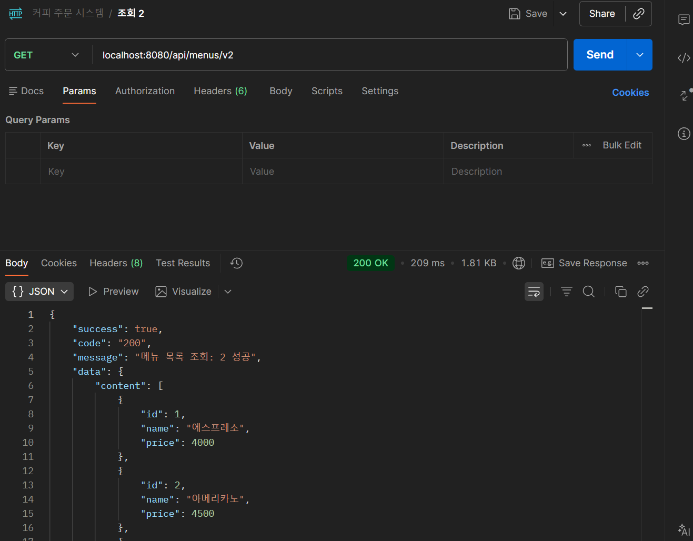


- 커피 메뉴 검색 기능:  포스트맨에서 아래와 같이 입력합니다. 총 2가지 버전이 있으며, 각각 엘라스틱 서치, ai 임베딩을 활용한 방식으로 조회합니다.
```
GET localhost:8080/api/menus/search/es?q=아메리카
GET localhost:8080/api/menus/search/ai?q=달달한거
```
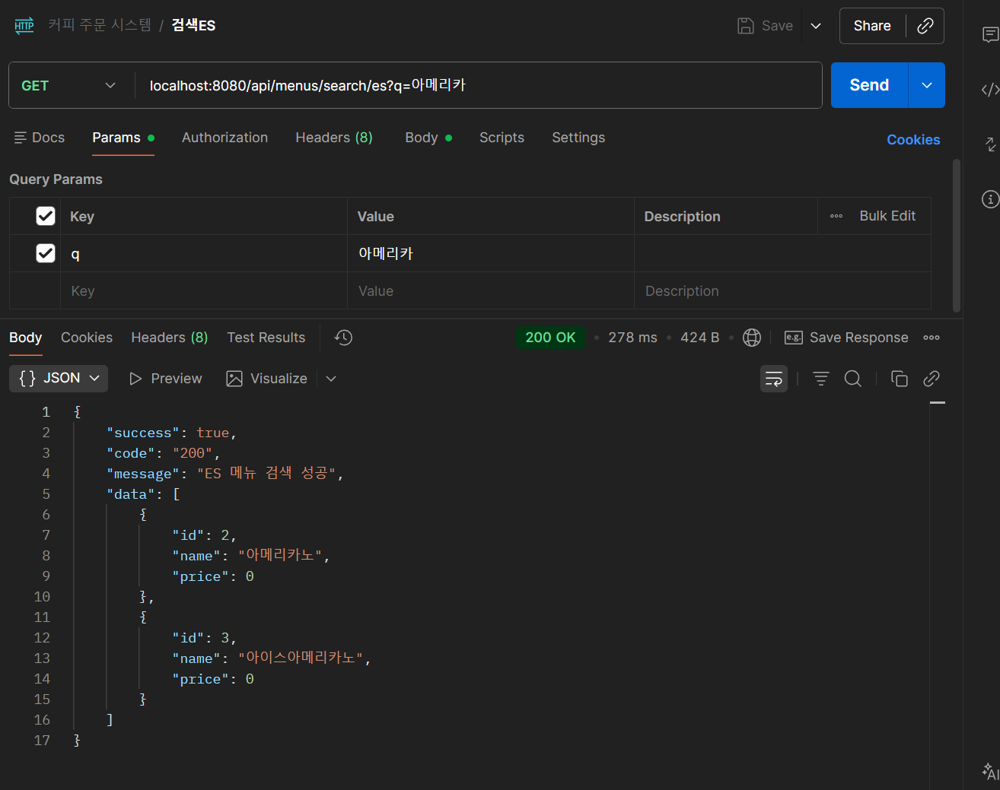
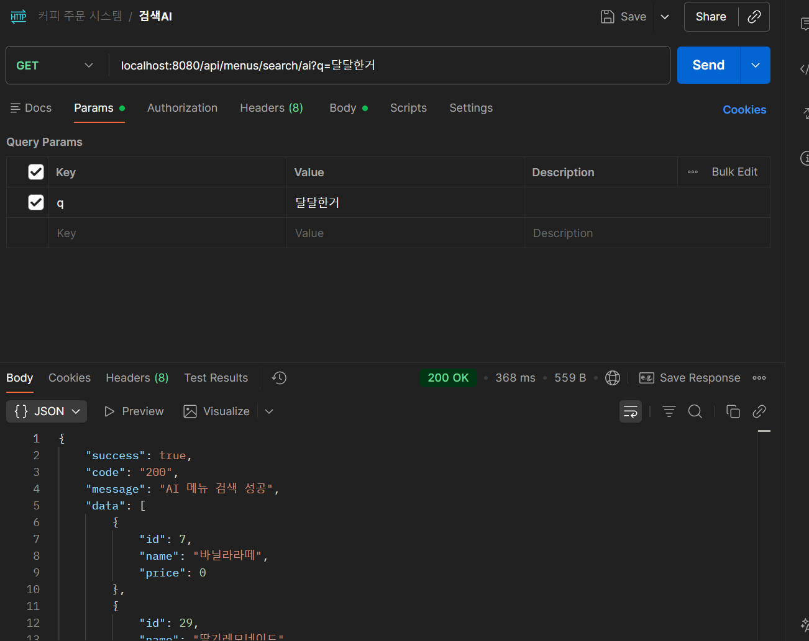


- 커피 메뉴 단건 조회 기능: 포스트맨에서 아래와 같이 입력합니다. 총 2가지 버전이 있으며, 각각 @Cacheable 어노테이션을 사용한 캐싱, 레디스템플릿을 사용한 캐싱 방법으로 조회합니다.
```
GET localhost:8080/api/menus/1/v1
GET localhost:8080/api/menus/3/v2
```

### Cacheable 을 사용한 경우
- 142 ms -> 6 ms로 조회 시간 감소
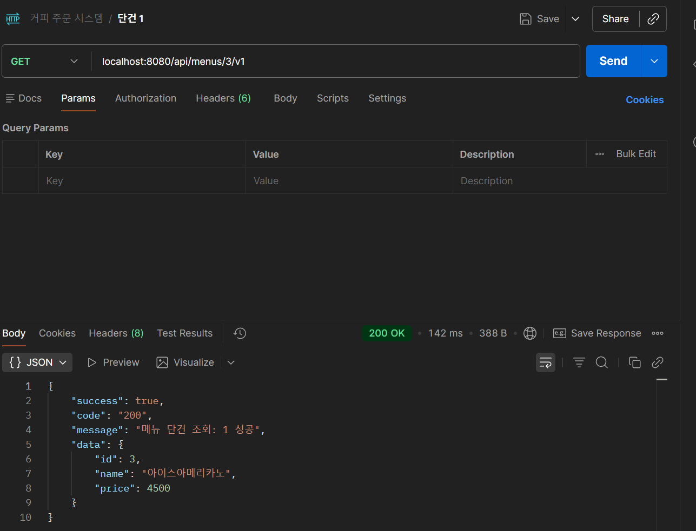 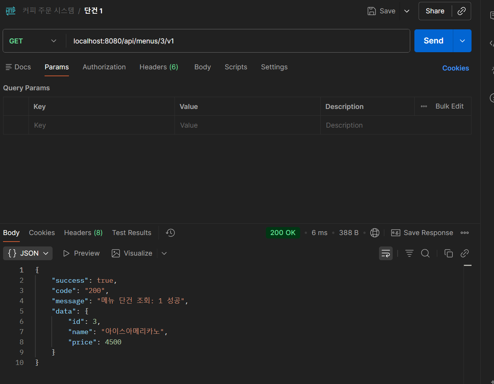

### 레디스템플릿을 사용한 경우
- 122 ms -> 8 ms로 조회 시간 감소
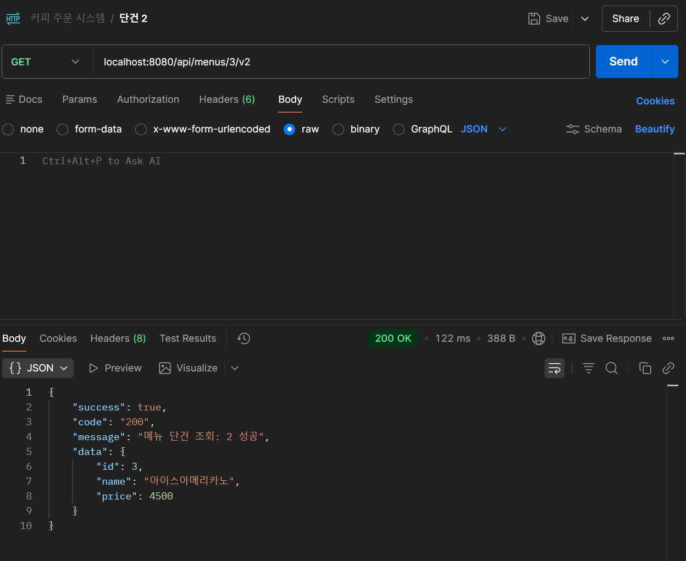 

- 인기메뉴 검색 기능: 포스트맨에서 아래와 같이 입력합니다.
```
GET localhost:8080/api/orders/popular

```

- 커피 메뉴 수정 기능: 포스트맨에서 아래와 같이 입력합니다. 총 2가지 버전이 있으며, 각각 @Cacheable 어노테이션을 사용한 캐싱, 레디스템플릿을 사용한 캐싱 방법으로 수정합니다.

```
PATCH localhost:8080/api/menus/5/v1
PATCH localhost:8080/api/menus/5/v2
```
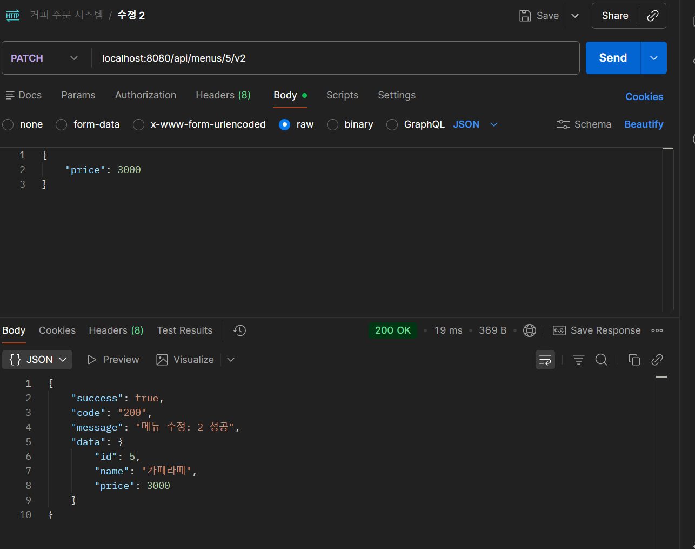

- 커피 메뉴 삭제 기능: 포스트맨에서 아래와 같이 입력합니다.
```
DELETE localhost:8080/api/menus/1
```

- 포인트 충전 기능: 포스트맨에서 아래와 같이 입력합니다. 총 4가지 버전이 있으며, 각각 낙관적 락, 비관적 락, 분산락, 최종선택(분산락+비관적락) 방법으로 충전합니다.
```
PATCH localhost:8080/api/points/1/opt
PATCH localhost:8080/api/points/1/pes
PATCH localhost:8080/api/points/1/dis

```
4번째 버전의 경우 실제 결제창이 구현되어 있습니다. 프로젝트 실행 후 localhost:8080/charge.html 을 입력하면 됩니다.
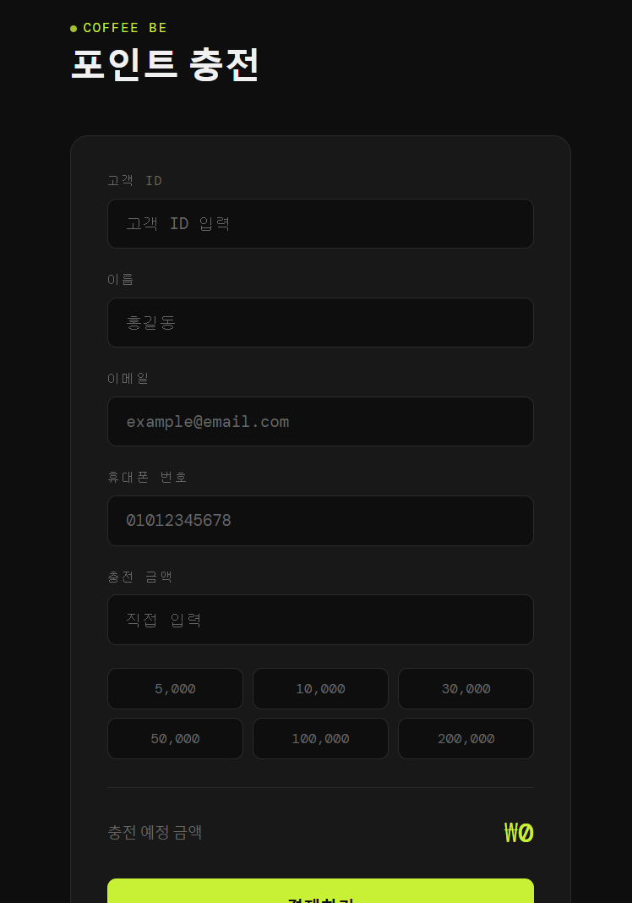

- 카트 담기 기능: 포스트맨에서 아래와 같이 입력합니다. 
```
POST localhost:8080/api/carts/1/items

body
{
    "menuId": 1,
    "quantity" : 1
}
```

- 카트 조회 기능, 카트 비우기 기능: 포스트맨에서 아래와 같이 입력합니다.
```
GET localhost:8080/api/carts/1
DELETE localhost:8080/api/carts/1/items
```

- 주문 기능: 포스트맨에서 아래와 같이 입력합니다. 총 2가지 버전이 있으며, 일반 주문과 루아스크립트를 활용한 주문 방식이 있습니다.

```
POST localhost:8080/api/orders
body
{
    "customerId" : 1,
    "cartId": 1
}

POST localhost:8080/api/orders/lua
body
{
    "customerId" : 1,
    "cartId": 2
}


```
## 테스트 결과
- 조회 기능별 성능 비교
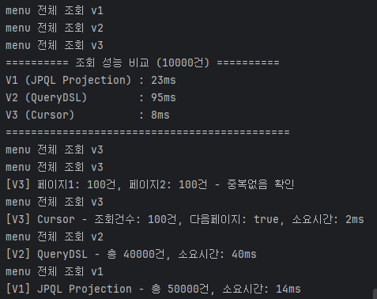
- 동시성 성능 비교
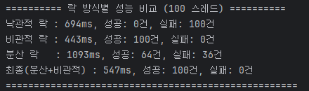
- ES 검색 성능 테스트
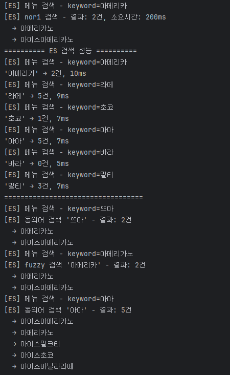